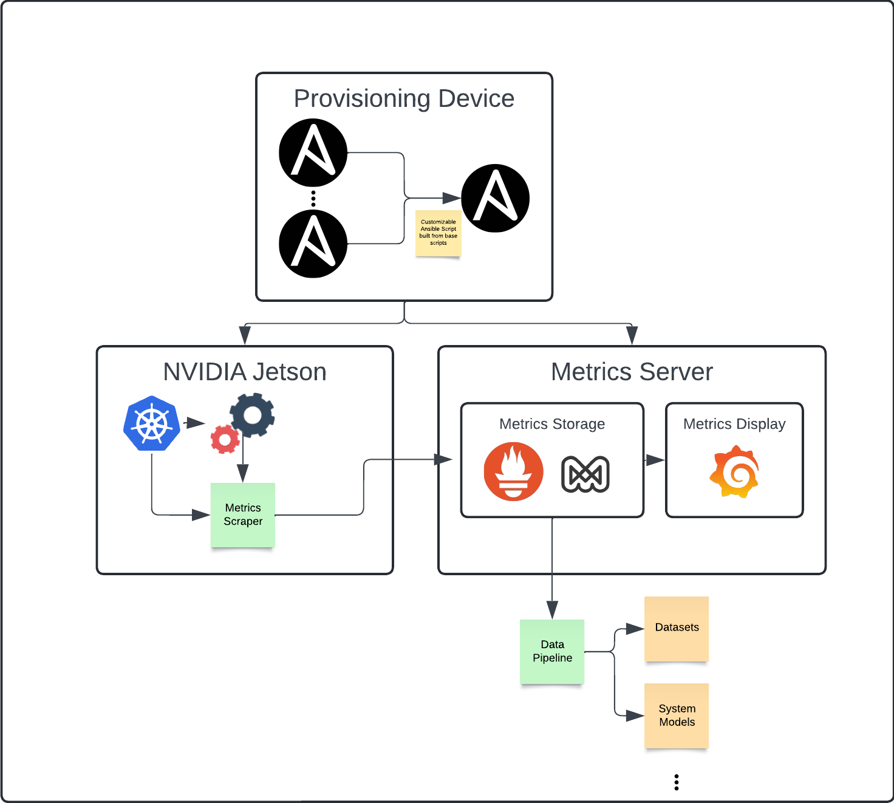

# perf-mon

This is a performance monitoring system for the Waggle infrastructure.
With this repository, you can set up a testbed monitoring system for any edge infrastructure.
Within this framwork we delegate two different roles, the edge device and the metrics server.
In short, the edge device is where you run applications. It is the computation that we will be monitoring.
The metrics server is the storage, display, and analysis part of this framework. 

## The Framework


Here we use ansible to create a reproducible basis for edge devices and metrics servers. 
Within this framework, we use a set of existing tools to make the framework flexible and reproducible.
On the backend, we have a simple and customizable data pipeline to pull data from the Prometheus API in the metrics server. 
Note that any Prometheus client can be used to gather data.

## Device Setup

Here is an overview of the devices we used and the setup we used for our experiments.

### Devices
For our metrics server, we used a laptop with Ubuntu 20.04

For our edge devices, we used
- NVIDIA Jetson Xavier NX
- NVIDIA Jetson Xavier Nano

with Jetpack versions
- 5.1.2
- 4.6.1
- 4.4.1 (the version used in the Waggle project)

### Metrics Server Setup
After flashing the device with Ubuntu 20.04, we ran the following commands

```
python3 create_ansible.py --enable-mimir --enable-grafana-dashboard
sudo ansible-playbook -i inventory-metrics-server.yaml ansible.yaml
```

### Edge Device Setup 
We flashed the Jetson devices using the SD card method (For example, see [here](https://developer.nvidia.com/embedded/jetpack-sdk-441-archive)).
After this, we ran

```
python3 create_ansible.py --enable-grafana-agent
sudo ansible-playbook -i inventory-edge-device.yaml ansible.yaml
```

## Gathering Data
After setting up the devices, it is time to start gathering data. For our experiments, we used a combination of [stressme](https://github.com/waggle-sensor/stressme/tree/main) and [SAGE applications](https://portal.sagecontinuum.org/apps/explore). 

## Using the Data Pipeline
Using the data pipeline, is fairly simple. All you need to do is set the Prometheus ip address and the set of filters. The filter language is described below. To run the data pipeline (on your local machine), you use the command

```
python3 data_pipeline.py --prometheus-url http://prometheus-ip:port --filter-file filters.json
```

### The Filter Schema
Below is the filter schema. A simple filter file is provided.

```
[
  [
    "metric-name",
    {
      "filter-name": "filter-value",
    }
  ],
]
```
